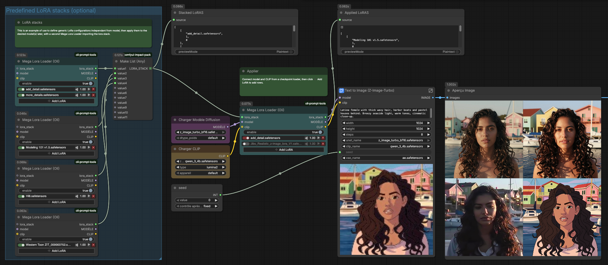
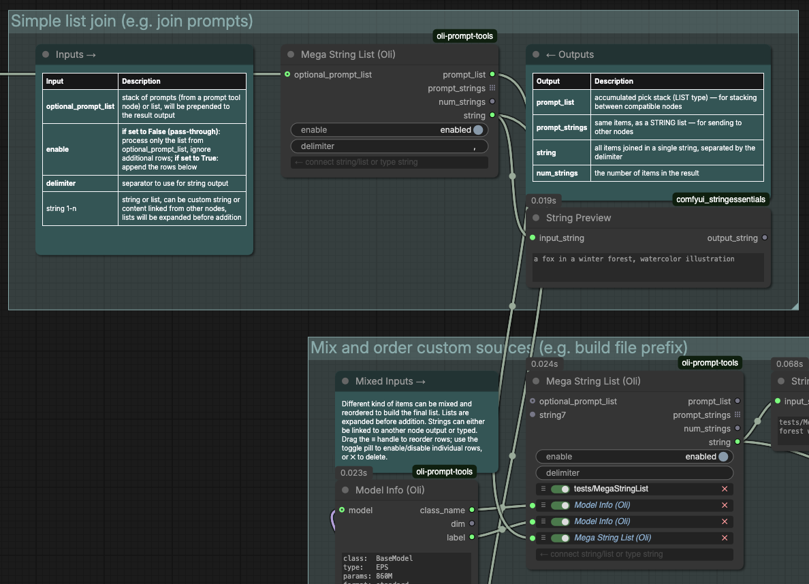
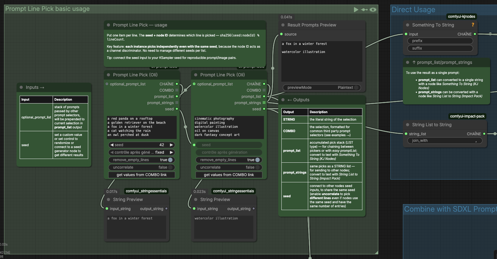
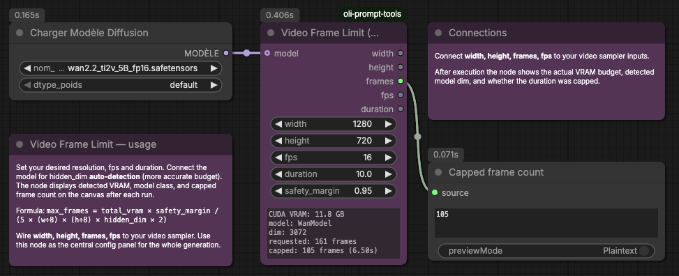
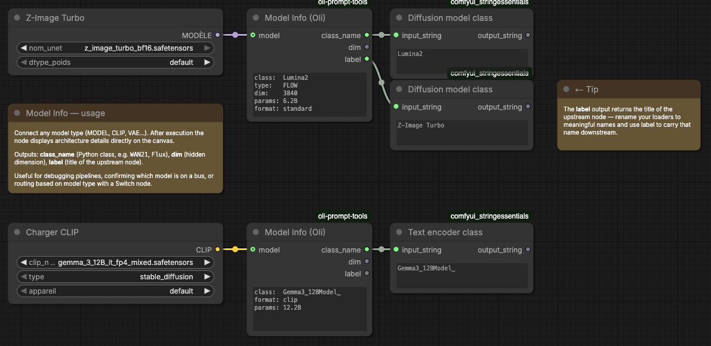
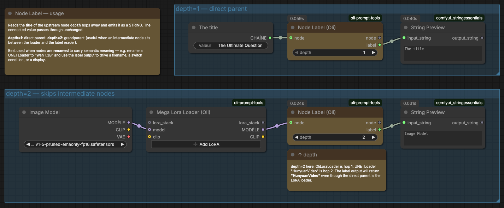

# Oli Prompt Tools

A collection of practical ComfyUI utility nodes designed to reduce workflow complexity. Each node solves a specific recurring problem — avoiding VRAM crashes, picking prompts deterministically, filtering incompatible LoRAs, or labelling model pipelines. No external dependencies beyond the standard ComfyUI environment.

[](https://www.buymeacoffee.com/magicoli) [](https://magiiic.org/donate/) [](https://github.com/sponsors/magicoli) 

## Nodes

| Node | Category | Purpose |
|---|---|---|
| [Mega Lora Loader](#mega-lora-loader-oli) | Oli/loaders | Stackable multi-LoRA loader with automatic compatibility filtering |
| [Mega String List](#mega-string-list-oli) | Oli/prompt | Collects strings and lists from multiple sources into a unified list |
| [Prompt Line Pick](#prompt-line-pick-oli) | Oli/prompt | Seed-driven line picker — uniform distribution, fully independent instances |
| [Video Frame Limit](#video-frame-limit-oli) | Oli/utils | Caps video duration to avoid VRAM out-of-memory crashes |
| [Model Info](#model-info-oli) | Oli/utils | Returns architecture details of any connected model |
| [Node Label](#node-label-oli) | Oli/utils | Reads and passes through the upstream node's title |

## Installation

**Via ComfyUI Manager** (recommended): search for *Oli Prompt Tools* and click Install.

**Manually:**
```bash
cd ComfyUI/custom_nodes
git clone https://github.com/magicoli/oli-prompt-tools
```

Restart ComfyUI. No additional dependencies required.

---

## Mega Lora Loader (Oli)

Stackable multi-LoRA loader inspired by [rgthree's Power Lora Loader](https://github.com/rgthree/rgthree-comfy). Key additions: stackable, and each LoRA's safetensors header is checked against the connected model's key map **before loading** — incompatible LoRAs are silently skipped rather than producing errors or corrupted output.

- Add as many LoRA rows as needed with the **➕ Add LoRA** button.
- Each row has an on/off toggle, a LoRA selector, and a strength slider.
- Incompatible LoRAs are highlighted in the UI (orange = incompatible, grey = disabled).
- Connect the `enable` input to a boolean condition to bypass all LoRAs at once — useful with switch or router nodes.
- **Two usage modes**: connect `model`/`clip` to apply LoRAs immediately, or leave them unconnected to only build a `LORA_STACK` without applying it. In stack-only mode the node acts as a LoRA definition block — chain several together, then feed the final stack to a downstream loader that has `model`/`clip` connected. This lets you define LoRAs once and apply them to multiple models at different points in the workflow.


[Mega Lora Loader example workflow](examples/mega_lora_loader.json)

**Inputs**

| Input | Type | Default | Description |
|---|---|---|---|
| lora_stack | LORA_STACK | — | Incoming stack from another loader (optional) |
| model | MODEL | — | Model to apply LoRAs to (optional) |
| clip | CLIP | — | CLIP encoder to apply LoRAs to (optional) |
| *(lora rows)* | — | — | Added dynamically via the ➕ button |
| enable | BOOLEAN | true | When false, passes model/clip/lora_stack through unchanged |

**Outputs**

| Output | Type | Description |
|---|---|---|
| lora_stack | LORA_STACK | Full stack including upstream entries |
| MODEL | MODEL | Model with all compatible LoRAs applied |
| CLIP | CLIP | CLIP with all compatible LoRAs applied |

---

## Mega String List (Oli)

Collects strings and lists from multiple sources into a single unified list. Each row can hold either **typed text** or a **connected node output** (STRING, LIST, or any type) — no separate input slots needed for typed vs. connected content. Rows can be individually toggled on/off, reordered by drag, or deleted. Lists from connected nodes are automatically expanded before addition.

- **Mixed sources** — combine typed strings, node outputs, and upstream prompt lists in any order in a single node.
- **Drag to reorder** — grab the ≡ handle to change the order of rows; the final list follows the visual order.
- **Per-row toggle** — disable individual rows without deleting them using the pill switch.
- **Chainable** — wire `optional_prompt_list` from a Prompt Line Pick or another Mega String List; the incoming list is prepended to the result.
- **Pass-through mode** — when `enable` is set to False (labelled *pass-through*), the node returns only `optional_prompt_list` unchanged and ignores all rows. Useful for temporarily disabling additions or for conditional branching.
- **Delimiter** — used both to split typed multi-value text into separate items, and to join all items into the `string` output. Supports escape sequences (`\n`, `\t`, …).
- Items equal to `"none"` (case-insensitive) are automatically removed — SDXL Prompt Styler's empty/ignore sentinel.


[Mega String List example workflow](examples/mega_string_list.json)

**Inputs**

| Input | Type | Default | Description |
|---|---|---|---|
| optional_prompt_list | LIST | — | Accumulated list from an upstream node — prepended to the result (optional) |
| enable | BOOLEAN | true | When false (*pass-through*): return only optional_prompt_list, ignore all rows |
| delimiter | STRING | `, ` | Splits typed text into items; also used to join the `string` output |
| string 1-n | \* | — | Dynamic rows — type text directly or connect any node output; lists are expanded |

**Outputs**

| Output | Type | Description |
|---|---|---|
| prompt_list | LIST | Combined list — wire to another Mega String List or Prompt Line Pick |
| prompt_strings | STRING (list) | Same items as a STRING output list — compatible with easy promptList |
| num_strings | INT | Number of items in the combined list |
| string | STRING | All items joined by the delimiter |

---

## Prompt Line Pick (Oli)

Reimplementation of the [easy promptLine](https://github.com/yolain/ComfyUI-Easy-Use) concept. Replaces `start_index` with a **seed**. The picked index is derived via `sha256(seed:node_id) % len(lines)`, giving a uniform distribution and full independence between instances: two pickers with the same seed pick at uncorrelated positions even when their lists have the same length or lengths that are multiples of each other. Output format is identical to easy promptLine — both STRING and COMBO return the list starting at the picked line.

- **Uniform distribution** — every line has equal probability regardless of list length, with no correlation between lists of similar sizes.
- **Full independence** — multiple instances in the same workflow each pick at independent positions, even with the same seed, because the node ID is part of the hash.
- **COMBO output** is compatible with any COMBO-typed input (e.g. SDXL Prompt Styler artist/style fields): the picked line is always the first element.
- **Stackable** — connect `optional_prompt_list` from a previous picker; this node appends its pick and passes the extended list through `prompt_list`. Chain as many pickers as needed, then feed into easy promptList or any string-join node.


[Prompt Line Pick example workflow](examples/prompt_line_pick.json)

**Inputs**

| Input | Type | Default | Description |
|---|---|---|---|
| prompt | STRING | — | One item per line |
| seed | INT | 0 | Workflow seed — share with KSampler for reproducible pairs |
| remove_empty_lines | BOOLEAN | true | Strip blank lines before picking |
| uncorrelate | BOOLEAN | true | When on: index = sha256(seed:node_id) % len — independent between instances. When off: index = seed % len — same as easy promptLine's start_index |
| optional_prompt_list | LIST | — | Accumulated list from an upstream picker (optional) — same type as easy promptList |

**Outputs**

| Output | Type | Description |
|---|---|---|
| STRING | STRING | The single picked line (scalar) |
| COMBO | COMBO (list) | The single picked line, compatible with COMBO-typed inputs (SDXL Prompt Styler etc.) |
| prompt_list | LIST | Incoming list with this pick appended — wire to the next picker or to easy promptList |
| prompt_strings | STRING (list) | All strings in the accumulated list — same format as easy promptList's prompt_strings |
| seed | INT | Pass-through — wire to the next picker without routing back |

---

## Video Frame Limit (Oli)

Caps video generation duration to avoid VRAM out-of-memory crashes. The frame budget is derived from transformer peak memory first principles rather than empirical constants:

```
bytes_per_latent_frame = TENSOR_COPIES × (width÷8) × (height÷8) × hidden_dim × 2
max_frames             = total_vram × safety_margin ÷ bytes_per_latent_frame
```

Where `TENSOR_COPIES = 5` (Q, K, V, attention output, residual activations) and `hidden_dim` is **auto-detected** from the connected model. Uses **total VRAM** rather than free VRAM — ComfyUI offloads weights layer-by-layer, so peak activation memory scales with total VRAM, not the remainder after model loading.

The node displays detected VRAM, model name, hidden dim, requested and capped frames directly on the canvas after each execution — making it usable as a standalone config panel for the whole generation.


[Video Frame Limit example workflow](examples/video_frame_limit.json)

**Inputs**

| Input | Type | Default | Description |
|---|---|---|---|
| width | INT | 832 | Generation width in pixels |
| height | INT | 480 | Generation height in pixels |
| fps | FLOAT | 16 | Frames per second |
| duration | FLOAT | 10 | Requested duration in seconds |
| safety_margin | FLOAT | 0.95 | Fraction of total VRAM to budget (0.95 = 5% headroom) |
| model | MODEL | — | Optional — enables hidden_dim auto-detection |

**Outputs**

| Output | Type | Description |
|---|---|---|
| width | INT | Pass-through |
| height | INT | Pass-through |
| frames | INT | Capped frame count |
| fps | FLOAT | Pass-through |
| duration | FLOAT | Actual duration after capping |

---

## Model Info (Oli)

Returns architecture details of any connected model (MODEL, CLIP, VAE, or any other type). Also reads the upstream node's title. Useful for debugging model pipelines, inspecting what arrived on a bus, or driving conditional logic based on model class.


[Model Info example workflow](examples/model_info.json)

**Inputs**

| Input | Type | Description |
|---|---|---|
| model | \* | Any model type (optional) |

**Outputs**

| Output | Type | Description |
|---|---|---|
| class_name | STRING | Python class name of the model (e.g. `WAN21`, `Flux`) |
| dim | INT | Hidden dimension auto-detected from the model |
| label | STRING | Title of the upstream node that produced the model |

---

## Node Label (Oli)

Passes any value through and outputs the title of the upstream node at a configurable traversal depth. Useful for labelling outputs, routing between branches, or building self-documenting workflows where node titles carry semantic meaning.


[Node Label example workflow](examples/node_label.json)

**Inputs**

| Input | Type | Default | Description |
|---|---|---|---|
| depth | INT | 1 | Hops to travel upstream (1 = direct parent, 2 = grandparent…) |
| node | \* | — | Any value — passed through unchanged (optional) |

**Outputs**

| Output | Type | Description |
|---|---|---|
| node | \* | Pass-through of the input value |
| label | STRING | Title of the node `depth` hops upstream |

---

## License

[GNU Affero General Public License v3.0](LICENSE)
